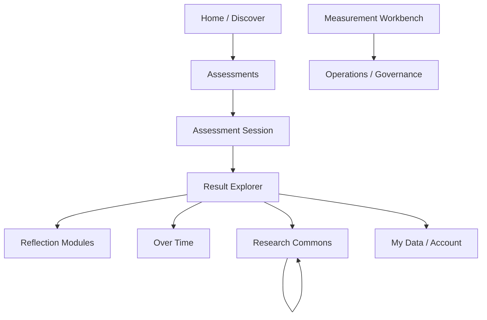
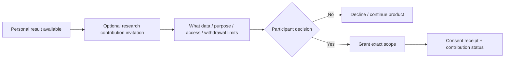

# Product Experience and Information Architecture

- Status: Normative target product-experience baseline
- Date: 2026-08-09
- Scope: Public Assessment, Result Explorer, Research Commons, Measurement Workbench, longitudinal/reflection entry points
- Client principle: headless product; standalone web is the primary reference experience, g7 remains an optional replaceable client

This document converts the PRD journeys into stable user-experience contracts that Figma/reference clients can implement. It is not a pixel specification and does not make Figma the source of truth for product state.

## 1. Experience principles

1. **Measure before narrate.** The product does not ask a narrative model to decide the participant's psychometric score or type.
2. **Continuous before categorical.** Personality Style can lead the explanation, but continuous/facet scores, uncertainty, and limitations remain available.
3. **Anonymous-first.** Account creation is optional for the core assessment/result journey unless a deployment policy explicitly narrows the product mode.
4. **Research is optional after value.** Research contribution is not bundled into assessment completion or required to see a personal result.
5. **Reflection is not diagnosis.** Reflection prompts help explore patterns; they do not convert personality scores into clinical claims.
6. **Time/context is opt-in.** Longitudinal observation is a separate purpose and experience.
7. **Failure is explicit and scoped.** Optional AI/research/longitudinal failure does not make a successful assessment look lost.
8. **Evidence is inspectable.** Result/version/provenance explanations are available without requiring the participant to understand internal engine terminology.
9. **No dark patterns.** Declining account, research, communications, or longitudinal opt-in is clear and does not use deceptive hierarchy/copy.
10. **Accessible by default.** Keyboard, screen reader, motion, contrast, error, timing and nonvisual chart equivalents are product requirements, not post-launch polish.

## 2. Top-level information architecture



Public navigation may expose only the participant/research surfaces. Workbench/Admin are role-gated and may be separate applications while consuming the same product APIs.

## 3. Public Assessment journey

### 3.1 Discovery

A published assessment card communicates before start:

- construct and plain-language purpose;
- expected duration / Quick or Deep mode;
- locale;
- whether the result is self-reflection/research rather than diagnosis;
- data needed to deliver the result;
- optional account/research/longitudinal capabilities separately;
- versioned limitations or important intended-use note when required.

Do not market an unvalidated cross-locale percentile or categorical style as if it were a scientific diagnosis.

### 3.2 Start

Default participant choices:

```text
Start anonymously
or
Sign in / link later (optional)
```

Core service terms/required processing are shown separately from optional research/communications/longitudinal choices. Optional consent is not pre-selected.

### 3.3 Session

Required states:

- loading current item;
- response accepted;
- offline/retry pending where supported;
- validation error with focus/assistive announcement;
- paused/saved state;
- session expired/cancelled/invalidated;
- completion accepted / scoring pending;
- recoverable scoring delay.

The client never fabricates local canonical session state. A retried response is visibly safe/idempotent rather than creating duplicate progress.

### 3.4 Completion

Completion confirmation means the response snapshot is durable; it does **not** claim the score already exists.

If scoring is delayed:

```text
Your responses are safely saved.
Your result is being calculated.
```

The UI must not display a placeholder personality type while waiting for scientific scoring.

## 4. Result Explorer

The result experience has progressive depth rather than one dense report.

```text
Level 1: Understand
  - primary Personality Style + adjacent/mixed style when applicable
  - one-sentence explanation grounded in measured dimensions
  - prominent non-diagnostic/intended-use framing

Level 2: Measure
  - continuous Big Five scores
  - facets where supported
  - uncertainty / comparison reference / norm context
  - limitations

Level 3: Why this result
  - explanation of contributing dimensions
  - version/provenance summary in participant-friendly terms
  - no raw model jargon required to understand the result

Level 4: Reflect
  - optional independently measured reflection modules
  - prompts/exercises grounded in allowed result fields

Level 5: Over time / Contribute
  - longitudinal opt-in
  - separate research contribution opt-in
```

### Narrative presentation rules

- Style is visibly an interpretation/presentation, not a hidden measured type.
- Near-boundary profiles can show “mostly X with Y-adjacent pattern” or other approved mixed presentation.
- LLM wording cannot change the deterministic style assignment or numeric scores.
- “Not like me” feedback is feedback, not a score correction.
- Generated descriptions avoid Barnum-style certainty where evidence is weak and show why the interpretation appeared.

### Result sharing/export

Participant may export machine-readable/human-readable result according to product policy. Any sharing link introduced later is revocable, scoped, expires by default, and does not expose raw responses unless explicitly chosen and permitted.

## 5. Reflection experience

Reflection modules are independent assessment experiences whose constructs are not inferred from Big Five.

Example flow:

```text
Result insight
-> “Explore how you respond to difficulty”
-> explain independent reflection construct
-> separate short instrument
-> its own score/limitations
-> cross-interpretation with Big Five through approved rules
-> optional reflection prompts/actions
```

For self-compassion or other proprietary/licensed instruments, the module remains unpublished until rights and locale/scientific evidence pass the publication gate.

The interface never frames a low reflection score as a diagnosis or moral failure.

## 6. Longitudinal / Over Time

Longitudinal participation has a separate opt-in/purpose explanation.

The participant can understand:

- what is being repeatedly collected;
- suggested frequency/window;
- local/offline behavior when Gyeot is used;
- how context/time may be used;
- how to pause/withdraw;
- what is trait versus temporary state/context;
- what comparison is within-person versus between-person.

Visualizations require nonvisual equivalents and must not overinterpret normal within-person variability as personality instability/pathology.

## 7. Research contribution journey

Research contribution appears after or separately from the personal result and is not a blocking modal.



The participant can later view research-contribution status and withdrawal controls according to the release policy. Product copy does not claim impossible retroactive removal from every already-public copy if the published policy cannot deliver that.

## 8. Research Commons experience

Researcher-facing public/controlled catalog surface supports:

- dataset search/discovery;
- version and access class;
- construct/instrument/locale/sample context;
- data card and known limitations;
- codebook/variable dictionary preview;
- scoring/calibration/norm provenance for derived variables;
- consent/research scope summary without participant identity;
- license;
- citation;
- checksums/release lineage/supersession;
- controlled-access application/download where applicable.

`semantic-data-portal` owns catalog/discovery implementation; Psychometrics Commons supplies the approved release manifest/artifacts through the integration boundary.

## 9. My Data / account experience

Anonymous participants must not be tricked into believing an account already exists.

When account linking is offered:

- explain benefit (cross-device/history) separately from research;
- require authentication through Keyverse;
- preserve historical assessment/result IDs;
- show link/unlink/merge conflict state honestly.

Data-rights surface shows export/deletion request lifecycle rather than a fake instant-delete button when processing/retention exceptions are durable asynchronous operations.

States include:

```text
requested
identity verification required
processing
completed
partially completed with explicit retained scope/basis
rejected with safe reason
failed with retry/support path
```

## 10. Measurement Workbench

Workbench is an evidence/governance workflow, not a spreadsheet of mutable scores.

Primary workflow:

```mermaid
flowchart LR
    construct[Construct]
    contract[AssessmentSpec / policy refs]
    author[Instrument/item authoring]
    review[Content / rights / locale review]
    pilot[Pilot]
    calibration[Calibration + recovery]
    structure[Model selection / scoreability]
    fairness[DIF / invariance / linking / norms]
    evidence[Publication evidence manifest]
    publish[Publish immutable instrument version]
    monitor[Monitor / suspend / retire / supersede]

    construct --> contract --> author --> review --> pilot --> calibration --> structure --> fairness --> evidence --> publish --> monitor
```



### Workbench views

- construct and intended-use definition;
- instrument/version/item bank;
- locale/translation review;
- rights/license evidence;
- rubric/blueprint/item-generation workflow where applicable through fast-mlsirm contracts;
- pilot/calibration status;
- recovery/fit/model-selection evidence;
- scoreability/general/subscale decisions;
- DIF/invariance/linking/norm evidence;
- publication blockers with explicit gate ownership;
- immutable publication/release history;
- monitoring/drift and suspension/retirement actions.

Inkspan supplies authoring primitives; fast-mlsirm supplies scientific/item-bank contracts/numerics; RankWeave may support discovery. Workbench remains the hosted workflow/publishing UI and does not duplicate those sources of truth.

## 11. Operator and governance experience

Operators need action-oriented views for:

- scoring backlog/poison jobs;
- failed integration/outbox/inbox state;
- instrument publication blockers;
- research-release privacy/scientific approval;
- data-rights request SLA/age/state;
- capability health/degradation;
- tenant authorization/admin actions;
- provider/AI policy denial and deterministic fallback rate;
- release provenance and recovery evidence.

Do not expose restricted participant/research linkage just because an operator dashboard exists. Privileged views are role/purpose-scoped and audited.

## 12. Error and degraded-state language

User-facing messages distinguish:

- “your response was not saved” from “your score is still processing”;
- “AI explanation is unavailable” from “your result is unavailable”;
- “research publication is delayed” from “your personal result is affected”;
- “this comparison is not scientifically supported” from “the system had an error.”

Technical error/reference IDs can be provided for support without exposing internals/secrets/raw data.

## 13. Figma governance

Figma is used for stable flows/screens/components after domain/API/state contracts are sufficiently defined.

Priority design sets:

1. Public Assessment session;
2. Result Explorer including mixed/adjacent narrative and uncertainty;
3. Research contribution and My Data/data-rights flows;
4. Research Commons discovery/release detail;
5. Measurement Workbench publication-evidence workflow;
6. longitudinal “Over Time” experience.

Figma must not invent a state/transition/API that contradicts the repository architecture. If a design exposes a missing product state, update the governing contract/ADR before implementation. Version-controlled product/architecture docs remain the source of truth for behavior; Figma remains the source for approved visual interaction/design details.

## 14. Reference-client acceptance

Before consumer GA, supported reference client acceptance includes:

- anonymous full journey;
- optional account link and no dark pattern;
- pause/resume/retry/scoring-pending recovery;
- continuous/facet result + uncertainty/limitations;
- deterministic no-AI result mode;
- separate research and longitudinal opt-in;
- data-rights lifecycle;
- exact locale/no silent fallback;
- WCAG 2.2 AA automated/manual/assistive-technology testing;
- mobile/responsive behavior appropriate to the supported surfaces;
- security headers/origin/session controls appropriate to the transport/client architecture;
- no clinical/MBTI-equivalence/high-stakes unsupported copy.
