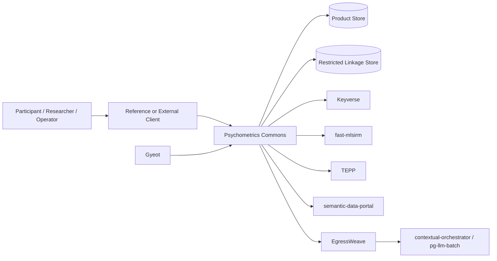
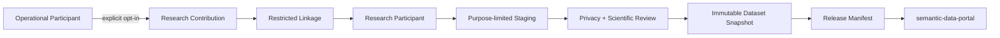

# Threat Model — Psychometrics Commons

- Status: Normative security design / evidence-tracking baseline
- Date: 2026-08-10
- Scope: Psychometrics Commons-owned runtime, product persistence, clients, and versioned integration boundaries
- Maturity rule: architecture controls described here are not evidence that a control is implemented on protected main; `docs/TRACEABILITY.md` remains the implementation-status authority.

## 1. Security objectives

Psychometrics Commons processes identity references, assessment responses, psychometric results, consent decisions, restricted research linkages, research staging data, and optional AI/longitudinal context. Security therefore protects more than confidentiality: it must preserve measurement integrity, exact-version provenance, tenant isolation, participant control, research-purpose separation, availability of deterministic core assessment, and the ability to reproduce scientific results without mutable hidden state.

The design follows four primary principles:

1. **Purpose-separated authority** — identity, operational assessment, restricted linkage, research staging/release, AI, and temporal analysis use separate ownership and authorization boundaries.
2. **Fail-closed scientific provenance** — unsupported, ambiguous, tampered, cross-tenant, or version-mismatched evidence cannot silently produce a score, release, consent effect, or research export.
3. **Capability-scoped degradation** — optional AI, TEPP, research catalog, or identity federation outages do not invent substitute evidence or erase already-valid local state.
4. **No blanket masking as architecture** — authorized workflows keep the exact construct-relevant data they require; unauthorized contexts receive no access through purpose-bound schemas, restricted linkage, encryption, and audited privileged paths.

## 2. Trust boundaries

No line in this diagram authorizes direct database access across bounded contexts. External-service references are opaque, versioned references/artifacts rather than cross-service foreign keys.

## 3. Protected assets

| Asset | Primary owner | Security property |
|---|---|---|
| assessment participant identity | Psychometrics Commons | tenant/resource authorization, stable opaque identity |
| Keyverse subject mapping | Psychometrics Commons linkage metadata + Keyverse SoR | authenticated append-only account-link history |
| assessment responses | Psychometrics Commons | confidentiality, integrity, exact snapshot replay |
| instrument/item versions | Psychometrics Commons | immutability, rights/evidence provenance |
| scoring inputs/results | Commons + fast-mlsirm contract boundary | exact version/digest binding, no silent semantic substitution |
| consent snapshots | Psychometrics Commons | purpose/version integrity, append-only revocation evidence |
| research identity linkage | restricted product boundary | highest-sensitivity separation, audited privileged access |
| research release bundle | Commons snapshot + semantic-data-portal catalog | no operational IDs, immutable digest/citation provenance |
| longitudinal observation metadata | Commons orchestration + Gyeot/TEPP | event-time integrity, membership/context fidelity |
| AI task inputs/outputs | Commons policy + orchestrator | purpose/provider/retention enforcement, untrusted-output validation |
| service and model credentials | owning secret manager/service | least privilege, no browser/log exposure |

## 4. Principal threat scenarios and required controls

| Threat | Attack/failure path | Required control | Evidence before GA |
|---|---|---|---|
| cross-tenant IDOR/BOLA | valid user guesses an opaque reference belonging to another tenant | server-derived tenant context, resource authorization before read/write, no default tenant | negative API/persistence tests across every tenant-scoped resource |
| public-reference alias collapse | whitespace, controls, or default-ignorable characters make a distinct external spelling share authorization, idempotency, or audit identity | fail-closed exact opaque-reference validation; no silent trim; UTS #39 default-ignorable rejection | constructor-slot and Display-contract tests for padded/invisible aliases |
| account-link takeover | attacker links anonymous history to a Keyverse account using only one side of proof | proof of anonymous-session control + authenticated subject control; append-only mapping; replay/conflict rejection | linking replay, conflict, unlink/recovery and cross-tenant tests |
| historical identity rewrite | account merge/unlink silently changes past session/result ownership provenance | ADR-0020 append-only identity-link events; historical participant/result refs immutable | persistence migration + supersession/audit tests |
| response replay/tampering | client reuses event/idempotency key with changed content | canonical digest, unique tenant/session-scoped keys, conflicting replay fail closed | property/concurrency tests plus physical uniqueness constraints |
| response ordering forgery | client timestamp/sequence determines canonical scoring order | server-assigned monotonic sequence; client times are evidence only | concurrent/offline replay tests |
| scoring provenance substitution | mutable alias or wrong model/norm/calibration is substituted after completion | exact pinned refs/digests; unsupported major/unknown scientific relation fail closed | golden replay, digest tamper, compatibility and recovery tests |
| fabricated fallback score | scoring service unavailable and product invents or approximates result | durable response snapshot + queued retry; no product-side numerical fallback | failure-injection test proving no score is produced |
| narrative mutates measurement | AI/style layer changes numeric score/uncertainty or presents unsupported diagnosis | separately versioned narrative mapping; read-only ScoreProfile input; deterministic fallback | no-score-mutation/adversarial narrative tests |
| research re-identification | operational identifiers, linkage keys, rare combinations or raw text leak into release | separate research namespace, restricted linkage, variable allowlist, privacy-risk review, immutable release manifest | automated identifier-leak tests + rare-cell/manual review evidence |
| consent purpose confusion | service consent is treated as research/longitudinal/communications consent | immutable purpose-specific consent snapshots; optional purposes absent by default | negative workflow tests and release eligibility tests |
| research withdrawal corruption | withdrawal mutates already cited immutable data or promises impossible global erasure | explicit future-processing policy; superseding releases/withdrawal notices where applicable | policy tests + release provenance behavior |
| outbox/inbox cross-tenant collision | upstream event ID collision suppresses another tenant/source's effect | tenant + consumer + source + source-event dedup scope, canonical digest, conflict quarantine | real PostgreSQL uniqueness/concurrency/crash tests |
| receipt-as-completion | inbox row is marked complete before a required external side effect occurs | pending → processing → completed semantics; stable downstream idempotency; completion evidence | crash-at-each-boundary tests |
| malicious/compromised provider output | AI provider returns invalid JSON, prompt-injected instructions, oversized/non-finite data | closed schema, size/finiteness/reference/provenance checks, bounded egress | adversarial provider fixtures and egress-denial tests |
| sensitive provider exfiltration | provider routing silently sends data to lower privacy/residency class | explicit task purpose/data/provider/residency/retention policy; no downgrade fallback | provider-class routing negative tests and audit evidence |
| longitudinal time manipulation | device clock/offline sync changes event order or invalidates within-person inference | preserve observed/recorded/received/available/validity clocks, timezone and anomaly flags | timezone/DST/clock-skew/offline replay tests |
| multiple-membership collapse | product assigns one primary group and destroys cross-classified context | explicit versioned memberships/weights; TEPP contract preserves them | data-contract and parameter-recovery fixtures |
| instrument content substitution | locale/items/norms changed under same published version | content-addressed immutable instrument/item versions; no silent locale fallback | digest/replay and publication-gate tests |
| unauthorized publication | operator bypasses rights/scientific/locale evidence and publishes instrument | ADR-0019 evidence gate; separate publisher authorization | missing/expired/conflicting evidence negative tests |
| privileged linkage-store misuse | internal actor queries participant↔research mapping without purpose | separate role/policy, audited privileged access, bounded views, no analytics default access | access-control tests and audit review |
| backup/restore confidentiality or rollback | backup exposes linkage/response data or restores stale schema without evidence | encrypted profile-specific backups, restore drills, schema/version validation, key controls | measured restore drill and integrity verification |
| dependency/supply-chain compromise | dependency/action/container/model artifact substituted | pinned immutable sources where practical, SBOM, dependency review, SAST/secret scanning, provenance | exact-release SBOM/provenance and rebuild verification |

## 5. AI-specific threat boundary

AI is not a trusted scientific authority. A model invocation can be omitted without breaking numeric assessment/scoring/result retrieval. Inputs are purpose-specific projections. Outputs are untrusted proposals or bounded narrative artifacts until schema/provenance/semantic validation succeeds. Prompt or provider text cannot grant tools, change tenant/resource authorization, change consent, override scientific publication gates, approve research releases, or mutate scores.

The deterministic boundary is intentionally stronger than a prompt-level safety instruction. Provider denial or contextual-orchestrator failure degrades the optional capability rather than causing direct provider bypass.

## 6. Research privacy boundary

The linkage boundary is not an analytics surface. Public/controlled release generation starts from research-domain identifiers and an approved variable projection. Direct Keyverse subject references, operational participant refs, linkage refs/keys, service credentials, and unrestricted raw narrative/free-text content are prohibited from public release unless a future separately governed use case establishes lawful purpose and explicit review.

## 7. Abuse and misuse boundaries

The initial product does not authorize clinical diagnosis/treatment, employment/admission/insurance/credit/legal decisions, official MBTI claims, unvalidated IQ/aptitude judgments, or covert assessment of third parties. A technically valid score cannot override an out-of-scope intended-use policy. Scientific and authorization gates are conjunctive: a high model score or confident AI judgment never compensates for a prohibited use or missing critical evidence.

## 8. Verification strategy

Security assurance is layered:

1. unit/property tests for reference/digest/state/idempotency invariants;
2. state-machine and concurrency tests for lifecycle races;
3. real PostgreSQL migration/uniqueness/rollback/crash tests as persistence lands;
4. API contract authorization and tenant-isolation tests when HTTP transport lands;
5. SAST, secret scanning, dependency review, SBOM and provenance gates;
6. adversarial AI/provider and egress-denial tests for optional model paths;
7. research-release leakage/privacy review tests;
8. backup/restore and degraded-mode drills per deployment profile;
9. independent review/assessment for claims that require external assurance.

Architecture mitigation is not risk closure. `docs/RISK_REGISTER.md` remains the evidence/acceptance register for unresolved material risk.

## 9. Current evidence boundary

Protected main already contains reusable domain invariants for session, response, scoring dispatch, result, consent, data-rights, instrument publication, item delivery, tenant authorization, participant account-linking primitives and integration event semantics. `docs/TRACEABILITY.md` names exact protected-main evidence. Physical persistence is not considered shipped merely because a Draft PR contains migrations, and target API/provider/deployment diagrams are not as-built evidence.

## 10. References

International Organization for Standardization & International Electrotechnical Commission. (2023). *ISO/IEC 25010:2023 Systems and software engineering—Systems and software Quality Requirements and Evaluation (SQuaRE)—Product quality model*.

National Institute of Standards and Technology. (2022). *Secure Software Development Framework (SSDF) Version 1.1: Recommendations for mitigating the risk of software vulnerabilities* (NIST SP 800-218). https://doi.org/10.6028/NIST.SP.800-218

Open Worldwide Application Security Project. (2025). *Application Security Verification Standard 5.0.0*.

World Wide Web Consortium. (2024). *Web Content Accessibility Guidelines (WCAG) 2.2*.

> Watch item: NIST published an Initial Public Draft of SP 800-218 Rev. 1 / SSDF 1.2 in December 2025. Until a final revision supersedes SP 800-218, the final SSDF 1.1 remains the normative baseline for this document.
