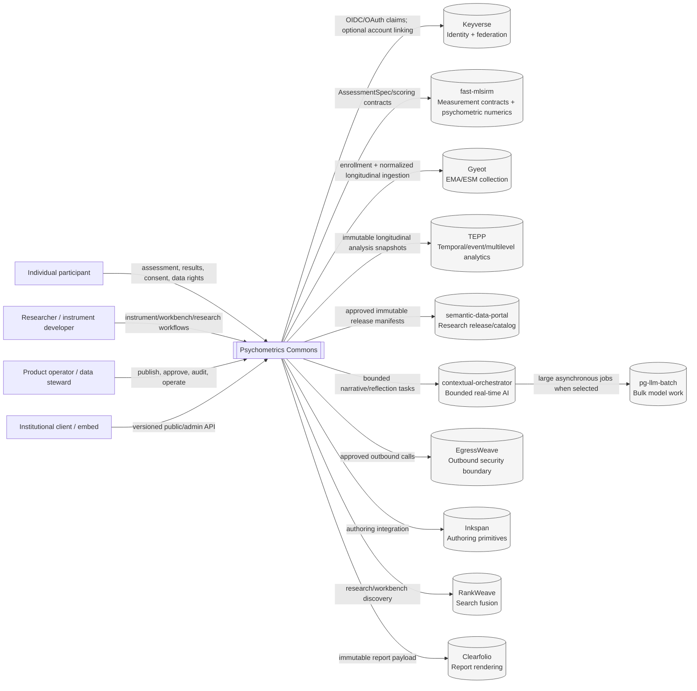
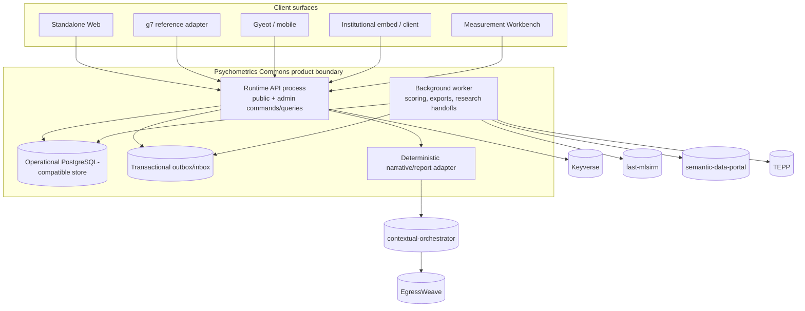
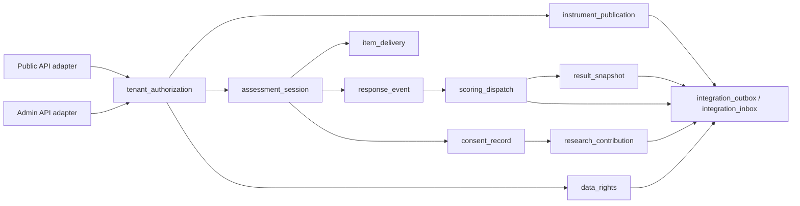

# Architecture Context, Container, and Component Views

- Status: Normative architecture view
- Date: 2026-08-09
- Authority: subordinate to accepted ADRs, `docs/PRD.md`, and `docs/TRD.md`
- Notation: repository-native Mermaid; concepts follow ISO/IEC/IEEE 42010:2022 stakeholder/viewpoint discipline

## 1. Stakeholders and concerns

| Stakeholder | Primary concerns | View(s) that answer the concern |
|---|---|---|
| Participant | privacy, anonymous use, result integrity, accessibility, data rights | context, session sequence, security/data flow, result provenance |
| Research participant | consent scope, withdrawal, re-identification risk, release transparency | research-release sequence, ERD, security/data classification |
| Researcher / instrument developer | versioning, calibration provenance, invariance, reproducibility | component, ERD, traceability, scoring sequence |
| Product operator | lifecycle control, degraded modes, retries, auditability | container, component, state, operations |
| Data steward | purpose limitation, linkage access, release approval, deletion/retention | ERD, security/data flow, research sequence |
| Institutional integrator | stable APIs, federation, tenancy, deployment portability | context, container, deployment, API/event ADR |
| Security/compliance reviewer | trust boundaries, least privilege, isolation, evidence | context, security/privacy, operations, ADRs |
| Maintainer | code ownership, dependency direction, migration safety, testability | component, traceability, architecture fitness functions |

## 2. System context

### Context invariants

- Psychometrics Commons is the hosted product and integration boundary, not a replacement for reusable CWL services.
- `fast-mlsirm` never depends on Psychometrics Commons.
- No external bounded context receives normal direct read/write access to the Psychometrics Commons application database.
- `g7`, standalone web, mobile, and institutional clients are replaceable clients, not systems of record.
- Optional integration failure is capability-scoped whenever scientifically and securely possible.

## 3. Container view — target hosted profile

The following is a **target container view**, not a claim that every container is already deployed on protected main.

### Container responsibilities

| Container | Owns | Must not own |
|---|---|---|
| Runtime API process | validation, authorization, commands/queries, state-machine entry points | psychometric numerical algorithms, IdP credentials |
| Background worker | durable scoring/export/research jobs, retries, quarantine, reconciliation | authoritative client state or another service's database |
| Operational store | product-owned lifecycle state and immutable product snapshots | Keyverse credential store, TEPP or portal tables |
| Outbox/inbox | durable cross-service delivery and deduplication evidence | business-domain truth independent of source resource |
| Narrative/report adapter | approved deterministic templates and optional bounded AI rendering | numeric score mutation |

The initial implementation may co-locate API and worker behavior in one deployable process. Logical ownership and transaction boundaries remain unchanged if deployment topology later splits them.

## 4. Component view — hosted runtime

### Component ownership rules

1. Domain components expose commands and queries; no component mutates another component's tables ad hoc.
2. State transitions are server-authoritative and fail closed on undocumented transitions.
3. `response_event` freezes immutable evidence before `scoring_dispatch` is allowed to create durable work.
4. `scoring_dispatch` consumes exact version references and delegates psychometric computation to `fast-mlsirm`.
5. `result_snapshot` is immutable; rescoring or corrected interpretation creates a superseding snapshot.
6. `consent_record`, `research_contribution`, and `data_rights` remain separate resources because their legal/purpose semantics differ.
7. Cross-service effects leave the local transaction through `integration_outbox`; consumers deduplicate through an inbox before side effects.

## 5. Viewpoint-to-artifact map

| Viewpoint | Primary artifact |
|---|---|
| Product intent | `docs/PRD.md` |
| Technical contracts | `docs/TRD.md` |
| Architectural ownership | `ARCHITECTURE.md`, `docs/adr/` |
| System context / containers / components | this document |
| Structural/behavioral UML | `docs/architecture/UML.md` |
| Logical persistence/data cardinality | `docs/architecture/ERD.md` |
| Security/privacy/data flow | `docs/architecture/SECURITY_AND_DATA.md` |
| Deployment/operations/recovery | `docs/architecture/DEPLOYMENT_AND_OPERATIONS.md` |
| Requirement-to-code evidence | `docs/TRACEABILITY.md` |
| Delivery order / exit criteria | `docs/ROADMAP.md` |

## 6. References

International Organization for Standardization. (2022). *ISO/IEC/IEEE 42010:2022 Software, systems and enterprise—Architecture description* (2nd ed.). ISO.
