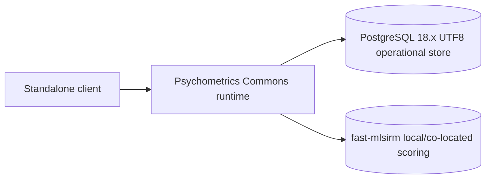
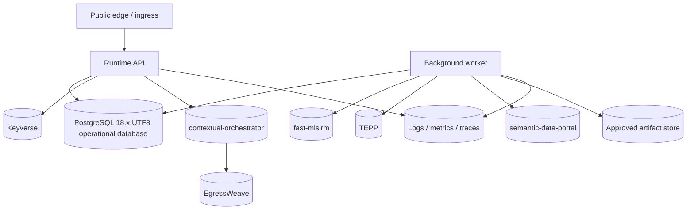

# Deployment, Operations, and Recovery Architecture

- Status: Normative target architecture view
- Date: 2026-08-09
- Scope: Community, Hosted, and Enterprise deployment profiles
- Important: environment-specific SLO/RPO/RTO values are not yet product commitments; GA is blocked until each supported profile defines and verifies them

The canonical profile names are **Community profile**, **Hosted profile**, and **Enterprise profile**. “Community/research,” “CWL hosted,” and “enterprise/self-hosted” may describe examples or operating modes in explanatory prose, but they are not separate domain profiles.

## 1. Deployment profiles

### Community profile

Minimum deployable capability:



Properties:

- anonymous core assessment available;
- no mandatory g7, TEPP, semantic-data-portal, contextual-orchestrator, or external model provider;
- scoring uses a contract-compatible fast-mlsirm path;
- initial supported relational store is upstream PostgreSQL 18.x with UTF8 server encoding per ADR-0015; forks/managed compatibility layers are not implicitly supported;
- local/self-managed operators remain responsible for their own backup and security posture unless a packaged distribution explicitly includes those services.

### Hosted profile



Properties:

- CWL services remain independently observable and deployable;
- optional dependency outage degrades only the capability it owns;
- product-owned state remains in the Psychometrics Commons operational store;
- the initial validated relational persistence target is upstream PostgreSQL 18.x with UTF8 server encoding; adding a managed/forked alternative or another server encoding requires the ADR-0015 capability/conformance evidence;
- artifact and database backups are independently recoverable and provenance-bound.

### Enterprise profile

Enterprise adds policy/configuration rather than a second domain model and may be customer/self-hosted or contractually CWL-operated:

- federation through Keyverse-compatible claims or approved identity integration;
- tenant-specific data residency and network policy;
- customer-controlled or approved key management;
- private/local scoring and model paths where contracted;
- customer-controlled retention and backup policies that still preserve product invariants;
- outbound provider policy can disable external AI without disabling deterministic assessment/scoring;
- stable API/event contracts allow customer-owned clients and CI/CD;
- responsibility for database operation, backup, recovery, networking, and observability is explicitly assigned rather than inferred from the profile name.

## 2. Capability dependency matrix

| Capability | Mandatory for Community | Mandatory for Hosted | Failure behavior |
|---|---:|---:|---|
| Product runtime | yes | yes | product unavailable |
| Upstream PostgreSQL 18.x UTF8 operational database | yes | yes | fail state-changing commands; no partial success |
| fast-mlsirm-compatible scoring | yes for scoring | yes | completed response snapshot remains durable; result pending |
| Keyverse | no | for authenticated/federated flow | anonymous and already-valid product session path remains where safe |
| contextual-orchestrator | no | optional | deterministic narrative fallback |
| EgressWeave | only when external egress exists | required for governed external provider calls unless an equivalently reviewed exact-authority boundary satisfies AI governance | provider capability fails closed; no bypass |
| TEPP | no | optional longitudinal analytics | observations remain durable; analysis waits |
| semantic-data-portal | no | optional Research Commons publication | personal results unaffected; registration waits |
| Gyeot | no | optional client | other clients remain available |
| Clearfolio | no | optional report renderer | machine-readable result remains available; approved fallback renderer/payload policy applies |

## 3. Runtime process model

A deployment may initially use one application process, but the operational architecture distinguishes:

```text
request/command execution
background durable jobs
scheduled reconciliation
outbox dispatch
inbox consumption
health/readiness probes
migration process
backup/restore process
```

A single process implementation must not blur transactional semantics merely because components are co-located.

## 4. Health and readiness

### Liveness

Liveness answers only whether the process can continue executing. It must not fail because an optional dependency is unavailable.

### Readiness

Readiness is capability/profile-aware. A service may be ready for anonymous result reads while authenticated account linking or research-release registration is degraded.

The health model must expose machine-readable capability state rather than one ambiguous global green/red flag.

For the product-owned operational database, state-changing readiness fails closed unless the server is an explicitly supported PostgreSQL major, uses UTF8 server encoding, and is writable. UTF8 is an execution prerequisite for the integration schema's `pg_unicode_fast` Unicode-aware reference constraints rather than a locale preference.

Example capability states:

```text
available
degraded_retryable
degraded_policy
unavailable_required
unavailable_optional
```

Health endpoints must not expose credentials, sensitive response contents, internal SQL, or restricted linkage values.

## 5. Observability contract

Every state-changing operation has `correlation_ref`; async work also has causation/job/resource references.

Minimum signals:

### API/domain
- request count/latency by operation and safe outcome class;
- accepted/rejected state transitions;
- idempotent replay and conflicting replay counts;
- tenant-authorization denials by safe reason class;
- result-read availability.

### Async/integration
- scoring job age/state/failure class;
- outbox oldest age, publish attempts, quarantine count;
- inbox pending/processing/completed/quarantined counts and duplicate suppression;
- export/deletion request age and state;
- research-release registration reconciliation age/state;
- TEPP/AI/report integration capability state.

### Scientific provenance
- scoring contract/version distribution;
- calibration/norm version use;
- unsupported contract or scoreability failure count;
- replay/reproducibility verification failures.

Logs use resource references, digests, safe error codes, and correlation IDs. Routine logs exclude raw assessment responses, tokens, secrets, and restricted linkage values.

## 6. Failure handling and retry classes

Retries are allowed only for failures classified as transient and idempotently repeatable.

| Failure class | Retry? | Required behavior |
|---|---|---|
| validation / unsupported contract | no | fail closed with stable machine code |
| authorization / tenant mismatch | no automatic retry | return denial; audit as appropriate |
| idempotency conflict | no | expose conflict without overwriting prior evidence |
| downstream transient transport | bounded | retry same immutable request; preserve attempt evidence |
| downstream policy denial | no bypass | capability degraded/denied |
| non-finite/scientific failure | no silent fallback | persist typed terminal scientific outcome |
| database transaction failure | caller may retry idempotently | no partial state or orphan event |
| poison event/job | bounded then quarantine | operator-visible typed cause + reconciliation path |

Retry budgets must be bounded, observable, and compatible with the deployment's total timeout/runtime budget.

## 7. Backup and restore

GA release is blocked until every supported Hosted/Enterprise deployment proves backup and restore for product-owned durable state; the Community profile must at minimum ship explicit operator guidance and a tested distribution-level restore procedure appropriate to its packaging.

Backup scope includes, as applicable:

- operational database;
- encrypted response payload store if separate;
- immutable report/research artifact store where product-owned;
- migration metadata;
- keys/config references needed to interpret encrypted or signed artifacts, according to the deployment key-management design.

Restore acceptance must prove:

1. tenant and authorization boundaries survive restore;
2. immutable snapshot/release digests still verify;
3. outbox/inbox deduplication and pending/processing state do not cause silent duplicate or missing side effects;
4. result provenance and supersession chains remain intact;
5. restricted research linkage remains restricted;
6. deletion/retention evidence is not resurrected into an invalid user-visible state;
7. application and schema versions can read the restored data or the documented migration path is applied.

## 8. RPO, RTO, and SLO governance

The architecture intentionally does not invent commercial SLA values before the deployment topology and load profile exist.

The rule is concrete:

> No deployment profile may be called GA or sold with availability/recovery commitments until that exact profile has version-controlled SLO, RPO, and RTO values, synthetic/real workload measurement, alert thresholds, backup frequency, restore evidence, and incident runbooks on the exact release architecture.

Until those values exist, the product may be labelled development, preview, beta, research, or another truthful pre-GA status.

## 9. Migration and rollback/roll-forward

- Schema migration and application deployment support at least one backward-compatible deployment window unless a separately approved maintenance migration states otherwise.
- Destructive migration requires verified pre-change backup and restore drill evidence.
- Published instrument/result/research bytes are not mutated to make a migration convenient.
- New required immutable references are deterministically backfilled or the migration fails closed.
- Rollback is used only when the storage/operation semantics are genuinely reversible; otherwise a tested roll-forward/compensation procedure is documented.
- Migration completion includes post-migration invariant/tenant/provenance verification.
- PostgreSQL major-version or server-encoding expansion/upgrade requires the ADR-0015 real-database compatibility suite before support is declared. Major-version changes that can alter immutable Unicode validation semantics also require reapplying the affected CHECK constraints so existing rows are revalidated.

## 10. Release topology evidence

A release candidate must capture:

```text
source commit / tag
build provenance
SBOM
container/package digests
schema migration version
supported database engine/major versions and server encoding
supported contract versions
runtime configuration schema version
dependency capability versions
instrument/scoring/calibration/norm provenance for bundled assessments
security/accessibility/coverage test evidence
backup/restore evidence when GA
```

A feature PR being green is not enough to establish this integrated evidence.

## 11. Operator runbook minimum set

Before GA, the repository must contain or link authoritative runbooks for:

- scoring backlog / fast-mlsirm outage;
- Keyverse/federation outage;
- database failover and restore;
- outbox/inbox poison event and reconciliation;
- research-release registration failure or digest mismatch;
- data-rights request stuck/failed/partial retention;
- account-linking conflict;
- AI/provider policy denial and deterministic fallback verification;
- suspected cross-tenant authorization incident;
- research linkage exposure incident;
- migration failure and roll-forward/rollback;
- release rollback or feature disablement without changing scoring semantics.

## 12. Operational acceptance matrix

| Evidence | Community | Hosted | Enterprise |
|---|---:|---:|---:|
| clean install/start | required | required | required |
| health/readiness capability state | required | required | required |
| anonymous end-to-end assessment | required | required | required unless deployment explicitly disables anonymous by policy |
| authenticated federation | optional | required for account feature | required when contracted |
| backup/restore | distribution guidance + tested packaged procedure | required for GA | required for GA/contract |
| tenant isolation | single-tenant mode may be used | required | required |
| failure injection | core dependencies | all enabled capabilities | all contracted capabilities |
| accessibility | supported reference client | supported reference client | supplied reference client / customer responsibility explicitly separated |
| provenance/SBOM | required release artifact | required | required |

## 13. Architecture fitness functions

CI/release automation should eventually enforce:

- no direct dependency database credentials;
- no optional dependency required for core Community profile startup;
- unsupported database engines, major versions, or server encodings fail readiness/installation rather than being silently accepted;
- migration rollback/restore test suite presence when migrations change;
- capability-scoped health schema compatibility;
- log fixtures contain no raw secrets/responses/restricted linkage;
- release manifest references exact artifact digests;
- backup/restore acceptance remains tied to current schema/application version;
- canonical Community/Hosted/Enterprise profile terminology remains synchronized across ADRs, glossary, TRD, architecture, and release documents.
