# Logical Entity-Relationship Model

- Status: Normative logical data model
- Date: 2026-08-13
- Scope: Psychometrics Commons-owned persistence only
- Important: this is **not** a claim that physical DDL or all tables are already implemented

The ERD defines target cardinalities, ownership, immutable boundaries, restricted identity linkage, longitudinal orchestration records, and integration evidence. Physical migrations may split or combine tables for performance, but they must preserve these semantics and may not create cross-service application-database coupling.

## 1. Logical ERD

```mermaid
erDiagram
    tenant_account ||--o{ assessment_participant : owns
    tenant_account ||--o{ instrument_definition : owns
    tenant_account ||--o{ data_rights_request : scopes

    instrument_definition ||--|{ instrument_version : versions
    item_definition ||--|{ item_version : versions
    instrument_version ||--|{ instrument_item : contains
    item_version ||--o{ instrument_item : referenced_by
    instrument_version ||--|{ instrument_release : publishes_as
    instrument_release ||--o{ assessment_session : administered_as

    assessment_participant ||--o{ participant_identity_link : links
    assessment_participant ||--o{ assessment_session : starts
    instrument_version ||--o{ assessment_session : administered_as
    assessment_session ||--o{ item_delivery_event : delivers
    item_version ||--o{ item_delivery_event : delivered_as
    assessment_session ||--o{ response_event : records
    assessment_session ||--o| response_snapshot : freezes
    response_snapshot ||--|{ response_snapshot_entry : contains
    response_event ||--o| response_snapshot_entry : frozen_as

    response_snapshot ||--o{ scoring_job : submitted_for
    scoring_job ||--o| result_snapshot : produces
    assessment_participant ||--o{ result_snapshot : owns

    assessment_participant ||--o| consent_ledger : records
    consent_ledger ||--o{ consent_event : appends
    assessment_participant ||--o{ consent_snapshot : decides
    consent_form ||--o{ consent_snapshot : instantiated_as
    assessment_participant ||--o{ research_contribution : contributes
    consent_snapshot ||--o{ research_contribution : authorizes

    assessment_participant ||--o{ research_identity_linkage : linked_under_restriction
    research_participant ||--o{ research_identity_linkage : linked_under_restriction
    research_participant ||--o{ dataset_snapshot_member : included_as
    dataset_snapshot ||--o{ dataset_snapshot_member : contains
    dataset_snapshot ||--o{ research_release : released_as

    assessment_participant ||--o{ longitudinal_enrollment : enrolls
    longitudinal_enrollment ||--o{ longitudinal_observation_record : ingests
    longitudinal_enrollment ||--o{ temporal_analysis_submission : submits

    assessment_participant ||--o{ data_rights_request : requests
    data_rights_request ||--|{ data_rights_propagation_state : enqueues
    data_rights_propagation_state }o--|| integration_outbox : references

    tenant_account ||--o{ integration_outbox : scopes
    tenant_account ||--o{ integration_inbox : scopes
    integration_outbox ||--o{ integration_delivery_attempt : dispatches
    integration_inbox ||--o{ integration_consumption : deduplicates

    tenant_account {
      string tenant_ref PK
      string tenant_status
      timestamp created_at
    }

    instrument_definition {
      string instrument_ref PK
      string tenant_ref FK
      string construct_ref
      timestamp created_at
    }

    instrument_version {
      string instrument_version_ref PK
      string instrument_ref FK
      string locale
      string assessment_spec_ref
      string scoring_version_ref
      string calibration_reference
      string norm_version_ref
      string narrative_version_ref
      string evidence_policy_ref
      string publication_evidence_ref
      string publication_state
      string content_digest
      timestamp created_at
    }

    instrument_release {
      string release_ref PK
      string instrument_ref FK
      string instrument_version_ref FK
      string construct_ref
      string locale
      string content_digest
      string publication_state
      timestamp created_at
    }

    item_definition {
      string item_ref PK
      timestamp created_at
    }

    item_version {
      string item_version_ref PK
      string item_ref FK
      string content_digest
      string response_schema_version
      timestamp created_at
    }

    instrument_item {
      string instrument_item_ref PK
      string instrument_version_ref FK
      string item_version_ref FK
      int item_order
      string selection_policy_ref
    }

    assessment_participant {
      string participant_ref PK
      string tenant_ref FK
      string participant_status
      timestamp created_at
    }

    participant_identity_link {
      string identity_link_ref PK
      string participant_ref FK
      string tenant_ref FK
      string identity_issuer
      string identity_subject_ref
      string link_state
      string supersedes_link_ref
      string actor_evidence_ref
      string reason_code
      timestamp effective_at
      timestamp created_at
    }

    assessment_session {
      string session_ref PK
      string participant_ref FK
      string instrument_version_ref FK
      string session_state
      string locale
      timestamp created_at
      timestamp latest_event_at
    }

    item_delivery_event {
      string delivery_event_ref PK
      string session_ref FK
      string item_version_ref FK
      int delivery_sequence
      string routing_policy_ref
      string payload_digest
      timestamp delivered_at
    }

    response_event {
      string response_event_ref PK
      string session_ref FK
      string client_event_ref
      string item_version_ref
      string payload_digest
      int server_sequence
      timestamp observed_at
      timestamp received_at
    }

    response_snapshot {
      string response_snapshot_ref PK
      string session_ref FK
      string content_digest
      int event_count
      int last_sequence
      timestamp frozen_at
    }

    response_snapshot_entry {
      string snapshot_entry_ref PK
      string response_snapshot_ref FK
      string response_event_ref FK
      int snapshot_sequence
      string item_version_ref
      string payload_digest
    }

    scoring_job {
      string scoring_job_ref PK
      string response_snapshot_ref FK
      string assessment_spec_ref
      string scoring_version_ref
      string calibration_reference
      string norm_version_ref
      string requested_output_schema_version
      string scoring_state
      timestamp created_at
    }

    result_snapshot {
      string result_snapshot_ref PK
      string participant_ref FK
      string scoring_job_ref FK
      string response_snapshot_ref FK
      string scoring_result_ref
      string instrument_version_ref
      string assessment_spec_ref
      string scoring_version_ref
      string calibration_reference
      string norm_version_ref
      string narrative_version_ref
      string engine_artifact_digest
      string supersedes_ref
      timestamp created_at
    }

    consent_ledger {
      string participant_ref PK
      timestamp created_at
    }

    consent_event {
      string participant_ref PK,FK
      string event_ref PK
      string consent_purpose
      string consent_decision
      string consent_form_version_ref
      string research_scope_ref
      int occurred_at_unix_ms
      timestamp created_at
    }

    consent_form {
      string consent_form_ref PK
      string consent_form_version_ref
      string purpose
      string content_digest
      timestamp published_at
    }

    consent_snapshot {
      string consent_snapshot_ref PK
      string participant_ref FK
      string consent_form_ref FK
      string purpose
      string decision
      string scope_ref
      timestamp effective_at
    }

    research_contribution {
      string contribution_ref PK
      string participant_ref FK
      string consent_snapshot_ref FK
      string research_participant_ref
      string research_scope_ref
      string contribution_state
      timestamp created_at
    }

    research_participant {
      string research_participant_ref PK
      string research_program_ref
      string pseudonym_key_version
      timestamp created_at
    }

    research_identity_linkage {
      string linkage_ref PK
      string participant_ref FK
      string research_participant_ref FK
      string research_program_ref
      string linkage_key_version
      timestamp created_at
    }

    dataset_snapshot {
      string dataset_snapshot_ref PK
      string manifest_digest
      string privacy_review_ref
      string scientific_review_ref
      string snapshot_state
      timestamp created_at
    }

    dataset_snapshot_member {
      string dataset_member_ref PK
      string dataset_snapshot_ref FK
      string research_participant_ref FK
      string contribution_ref
    }

    research_release {
      string research_release_ref PK
      string dataset_snapshot_ref FK
      string manifest_digest
      string access_class
      string supersedes_ref
      timestamp published_at
    }

    longitudinal_enrollment {
      string enrollment_ref PK
      string participant_ref FK
      string program_ref
      string consent_snapshot_ref
      string collection_system_ref
      string enrollment_state
      timestamp enrolled_at
      timestamp latest_event_at
    }

    longitudinal_observation_record {
      string observation_record_ref PK
      string enrollment_ref FK
      string source_system_ref
      string source_observation_ref
      string construct_ref
      string measure_ref
      string scoring_version_ref
      string theta_ref
      string uncertainty_ref
      string membership_context_ref
      timestamp validity_start_at
      timestamp validity_end_at
      timestamp recorded_at
      timestamp received_at
      timestamp ingested_at
    }

    temporal_analysis_submission {
      string analysis_submission_ref PK
      string enrollment_ref FK
      string analysis_spec_ref
      string observation_set_digest
      string analysis_state
      string tepp_artifact_ref
      string failure_evidence_ref
      timestamp submitted_at
      timestamp completed_at
    }

    data_rights_request {
      string request_ref PK
      string tenant_ref FK
      string participant_ref FK
      string request_kind
      string scope_ref
      string request_state
      string verification_evidence_ref
      string operation_ref
      string completion_evidence_ref
      timestamp requested_at
      timestamp latest_event_at
    }

    data_rights_propagation_state {
      string request_ref PK,FK
      string dependent_system_ref PK
      string tenant_ref FK
      string source_ref
      string event_ref
      string current_state
      timestamp latest_event_at
    }

    integration_outbox {
      string outbox_event_ref PK
      string tenant_ref FK
      string event_type
      string source
      string subject_ref
      string correlation_ref
      string causation_ref
      string schema_version
      string payload_digest
      timestamp occurred_at
      timestamp published_at
    }

    integration_delivery_attempt {
      string delivery_attempt_ref PK
      string outbox_event_ref FK
      int attempt_number
      string delivery_state
      string failure_class
      timestamp attempted_at
    }

    integration_inbox {
      string inbox_message_ref PK
      string tenant_ref FK
      string source
      string source_event_ref
      string consumer_name
      string payload_digest
      string processing_state
      string side_effect_key
      string completion_evidence_ref
      timestamp first_seen_at
      timestamp completed_at
    }

    integration_consumption {
      string consumption_ref PK
      string inbox_message_ref FK
      string side_effect_ref
      string consumption_state
      timestamp completed_at
    }
```

## 2. Reconciliation notes: target model versus current protected main

The target ERD deliberately includes several logical entities that are not yet physical tables:

- `instrument_release` is the locale-specific publication identity already owned by `src/instrument.rs`. Physical `migrations/0006_instrument_release.sql` persists that one-row aggregate (immutable manifest columns plus `publication_state`); HTTP publication transport remains Target.
- `data_rights_request` and `data_rights_propagation_state` are the first durable export/deletion slice. Physical `migrations/0003_data_rights_propagation.sql` stores requested-state identity plus one local outbox event per dependent system; verification, processing, completion, and dependent-system execution remain Target.
- `item_delivery_event` reflects the already-merged `src/item_delivery.rs` domain primitive; durable persistence/API orchestration is still Target.
- `consent_ledger` and `consent_event` persist the already-merged `src/consent.rs` append-only ledger. Physical persistence is carried by Active PR #49 (`migrations/0005_consent_lifecycle.sql`); HTTP consent transport and derived snapshot tables remain Target.
- `participant_identity_link` is the persistence target accepted by ADR-0020. The current `src/participant.rs` current-link fields are an application-domain first-link projection, not the future mutable persistence source of truth. The Active PR successor of #133 persists append-only link and link-end rows plus a derived current projection, restores that projection on exact replay, and rejects a second unterminated issuer-scoped subject in the database; HTTP transport remains Target.
- `longitudinal_enrollment`, `longitudinal_observation_record`, and `temporal_analysis_submission` make the ADR-0008 Commons-owned Gyeot/TEPP orchestration boundary explicit. No TEPP analytical kernel is duplicated here.
- `integration_outbox`, `integration_delivery_attempt`, `integration_inbox`, and `integration_consumption` reflect `src/integration.rs` domain semantics. Outbox/inbox/delivery-attempt tables are on protected main; `integration_consumption` pending/processing/completed/quarantined persistence and expire-and-reclaim of a crashed processing claim exist only on this Active PR until merged.

This section is a maturity guard: a logical entity may be architecture-complete without being as-built database evidence.

## 3. System-of-record boundaries

The ERD includes only Psychometrics Commons-owned state. The following values are **references**, not local copies of another service's source-of-truth tables:

- `identity_issuer` / `identity_subject_ref` → Keyverse identity/federation domain;
- `assessment_spec_ref`, `scoring_version_ref`, `calibration_reference`, `norm_version_ref` → fast-mlsirm scientific contracts/artifacts;
- `collection_system_ref`, `source_system_ref` → Gyeot or another approved collection adapter identity;
- `analysis_spec_ref`, `tepp_artifact_ref` → TEPP temporal-analysis domain;
- semantic-data-portal catalog/release references → research catalog/release presentation;
- contextual-orchestrator execution references → bounded AI domain.

No local foreign key is created into another service's database.

## 4. Immutable and append-only aggregates

Once semantically published/frozen, the following are append-only or superseded rather than mutated in place:

- `instrument_version` after publication;
- `instrument_release` manifest columns after first persist (only `publication_state` may advance);
- `item_version` after publication;
- `item_delivery_event`;
- `response_snapshot` and `response_snapshot_entry`;
- `result_snapshot`;
- `consent_snapshot`;
- `participant_identity_link` history;
- accepted `longitudinal_observation_record` evidence, with corrections represented by explicit supersession/version policy rather than silent overwrite;
- approved `dataset_snapshot`;
- published `research_release`.

Operational fields such as delivery attempt, inbox processing, enrollment state, or analysis-submission state may change according to their own audited lifecycle; they must not alter the immutable scientific payload they reference.

## 5. Critical uniqueness and idempotency constraints

A physical schema must enforce equivalents of the following constraints:

| Constraint | Purpose |
|---|---|
| unique `(session_ref, delivery_sequence)` | authoritative item-presentation order |
| unique `delivery_event_ref` | no delivery evidence identity reuse |
| unique `(session_ref, client_event_ref)` | response replay idempotency |
| unique `(session_ref, server_sequence)` | authoritative response ordering |
| unique `response_event_ref` | no server event identity reuse |
| unique `response_snapshot_ref` and one canonical completed snapshot per session/version policy | immutable scoring evidence |
| unique `release_ref` for one locale-specific publication identity | instrument-release replay safety |
| unique `(instrument_version_ref, item_order)` | deterministic published order |
| unique `(instrument_version_ref, item_version_ref)` when duplicates are not explicitly allowed by publication policy | publication integrity |
| at most one current Active `participant_identity_link` per participant under the accepted single-account-link policy | unambiguous current account projection |
| unique active `(tenant_ref, identity_issuer, identity_subject_ref)` unless an explicit account-merge ADR permits otherwise | prevent one external subject from silently owning multiple product participants |
| unique `(enrollment_ref, source_system_ref, source_observation_ref)` | longitudinal ingestion replay safety |
| unique analysis-submission idempotency identity per `(enrollment_ref, analysis_spec_ref, observation_set_digest)` | repeatable TEPP dispatch |
| unique `(tenant_ref, source, outbox_event_ref)` or an equivalently stronger globally unique event identity with tenant binding | durable outbound event identity |
| unique `(tenant_ref, consumer_name, source, source_event_ref)` | tenant-bound inbox deduplication |
| unique research linkage for `(research_program_ref, participant_ref)` unless an ADR explicitly permits rotation semantics | controlled pseudonym mapping |
| unique manifest digest identity for a published research release reference | release replay safety |

Idempotency keys are tenant/resource scoped; a key from one tenant cannot suppress or replay another tenant's state change.

## 6. Participant identity-link boundary

`participant_identity_link` implements ADR-0020's product-owned append-only account-attachment evidence. It is deliberately separate from `assessment_participant` and from the research linkage table.

Requirements:

- `assessment_participant.participant_ref` remains stable whether the person is anonymous, linked, unlinked, or recovered;
- link/unlink/relink/recovery appends lifecycle evidence rather than replacing historical issuer/subject values;
- the current link is a derivable projection over valid lifecycle records;
- issuer and subject references remain opaque and provider scoped;
- historical sessions/results never cascade-delete or rewrite because an IdP account changes;
- restricted research linkage never reads the current account-link table as its public pseudonym namespace;
- data-rights/retention handling is explicit and auditable.

## 7. Longitudinal boundary

The Commons longitudinal tables are orchestration/evidence records only:

- `longitudinal_enrollment` binds product participant, program, consent, and collection-system references;
- `longitudinal_observation_record` stores normalized observation identity/time/construct/version/context references required to reproduce a submission, not a duplicate Gyeot application database;
- `temporal_analysis_submission` records exact observation-set digest, TEPP analysis specification, lifecycle, and returned artifact reference.

The model preserves four distinct time meanings so temporal leakage can be tested without
silently collapsing source and platform clocks:

- `validity_start_at` and `validity_end_at` are the validity-time interval for the
  observation; a point observation uses the same instant for both fields.
- `recorded_at` is when the source collection system recorded the observation.
- `received_at` is when Psychometrics Commons received the candidate at its trust
  boundary.
- `ingested_at` is when the normalized observation was durably accepted by Commons.

The source interval is retained even when source clocks are skewed. Validation records
impossible or untrusted ordering as typed evidence rather than rewriting timestamps;
platform receipt/ingestion ordering remains monotonic. Membership/context is
versioned/referenced so multilevel, cross-classified, and multiple-membership semantics
are not flattened before TEPP analysis.

## 8. Integration tenant binding and crash-safe consumption

`integration_outbox.tenant_ref` is derived from the product-owned subject/resource in the same local transaction as the business mutation and outbox record. A caller-provided tenant string never becomes authoritative merely because it appears in an event body.

Before a consumer creates a processable inbox record it validates:

1. event source and schema/canonicalization version are supported;
2. canonical payload digest matches ADR-0014;
3. envelope `tenant_ref` matches the subject/resource authority expected by the consumer;
4. a replay of `(tenant_ref, consumer_name, source, source_event_ref)` has the same digest and compatible required semantics.

A tenant/resource mismatch or conflicting replay is quarantined/fails closed before side effects.

`integration_inbox.processing_state` models at least `pending`, `processing`, `completed`, and `quarantined`/terminal failure. Receipt alone is not completion. For a local side effect, the domain mutation and inbox completion commit atomically. For a non-local side effect, processing records a durable local work/outbox item or stable external idempotency key; `completed` is written only after completion evidence is verified. A crash therefore leaves recoverable state instead of suppressing an effect that never happened.

## 9. Restricted research linkage boundary

`research_identity_linkage` is the highest-sensitivity product-owned data structure because it bridges operational participant identity to research pseudonym identity.

Requirements:

- separate database role/authorization policy from normal assessment read paths;
- no general analytics query access;
- no export into public research bundles;
- audited privileged access;
- versioned pseudonym/linkage-key metadata;
- deletion/retention behavior governed by explicit research scope, law, and ethics policy rather than blanket row masking.

## 10. Payload storage

The logical model stores `payload_digest` because routine domain, audit, and observability paths should not require raw response content. A deployment may store the encrypted response payload in the operational database or an approved encrypted object store.

Whichever adapter is chosen must preserve:

- exact binding between payload/reference and digest;
- tenant/resource authorization;
- encryption and key-rotation policy;
- deletion/export propagation;
- immutable snapshot replay;
- no raw payload in routine logs, outbox metadata, or public release manifests.

## 11. Naming contract

Database objects use at least two descriptive words and `snake_case` by default. Short legacy names are not introduced for convenience. Public identifiers remain opaque, non-numeric references even if a storage engine uses internal surrogate keys.

## 12. Migration contract

The first physical migration must be reviewed against this logical model and the accepted ADRs. Subsequent migrations must:

1. preserve a backward-compatible application deployment window;
2. include explicit data transformation and rollback/roll-forward evidence;
3. never mutate published scientific payloads to emulate a schema upgrade;
4. backfill new immutable references deterministically and audibly;
5. prove tenant and identity-boundary constraints after migration;
6. pass backup/restore verification before destructive changes;
7. preserve tenant-bound outbox/inbox uniqueness and crash-recoverable processing state;
8. preserve append-only participant identity-link history and longitudinal source-time semantics.

## 13. As-built rule

Until physical migrations exist, this document is the **logical target ERD**. When migrations are introduced, CI must generate or validate an as-built schema representation and compare its required entities, relationships, uniqueness constraints, tenant bindings, processing-state semantics, identity-link history, longitudinal time semantics, and ownership rules against this model. Silent divergence is a release defect.
