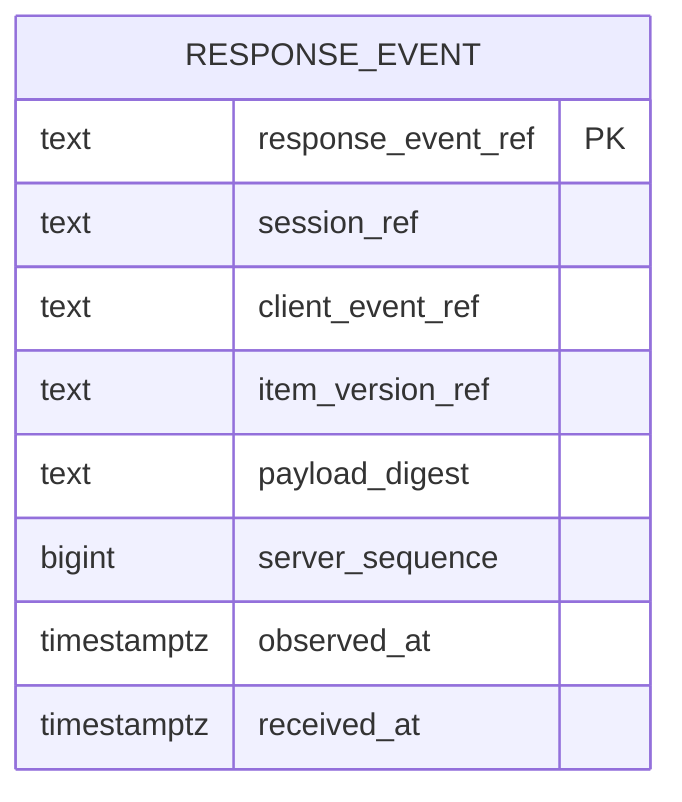
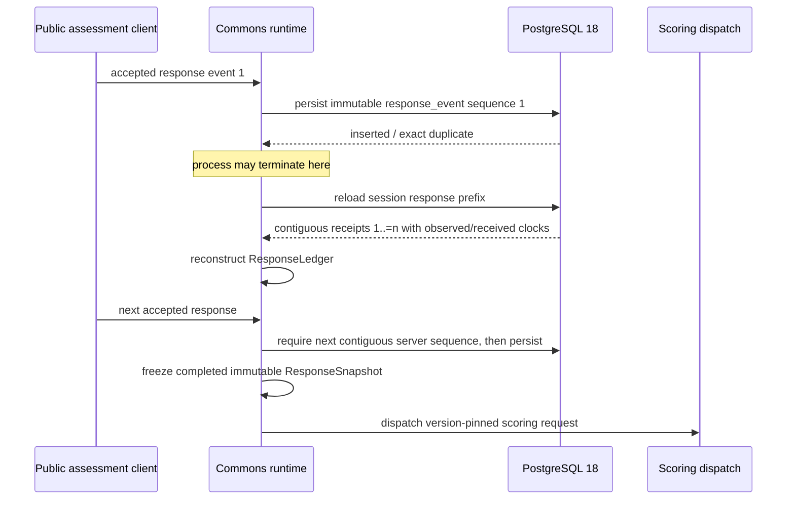

# Response-event persistence view

- Status: **IMPLEMENTED_ON_ACTIVE_PR** #284
- Protected-main baseline evaluated: `503a4e640eeba0f5e126fa4c4078d8d21aebb93b`
- Governing decisions: ADR-0005, ADR-0010, ADR-0015
- Product owner: Psychometrics Commons

This view maps the bounded response-event persistence slice carried by Active PR #284. It is not protected-main truth until the unchanged reviewed/check-clean PR head is integrated. It does not redefine scoring, item delivery, consent, Gyeot collection, TEPP analysis, or any external service database.

## Product responsibility

A participant may answer one or more items and lose the runtime process before the assessment is completed. The product must be able to reload the exact accepted response prefix, preserve its evidence, continue with the next response, and later freeze the same immutable scoring input as an uninterrupted control. No restart path may invent an answer, reorder accepted events, collapse an identity alias, or turn a damaged durable prefix into a valid scoreable snapshot.

## Physical relation

`migrations/0020_response_event.sql` owns one PostgreSQL 18 relation:

The relation is intentionally narrow. It stores accepted event identity and provenance, not plaintext response bodies or scores. `response_event_ref` is the immutable primary identity. `(session_ref, client_event_ref)` is the client-idempotency identity. `(session_ref, server_sequence)` prevents two accepted events from occupying the same server position.

All four public reference columns use the migration-owned `response_event_reference_is_valid` predicate. That predicate matches the Rust 1.97 / Unicode 17 opaque-reference boundary for numeric-like aliases, Unicode outer whitespace, and control characters. Migration reapplication replaces and revalidates the owned reference CHECK constraints so a weakened historical schema is repaired when its rows are valid and fails closed when invalid historical identity is present.

## Lifecycle and restart sequence

Write-time sequence allocation validates both `COUNT(*)` and `MAX(server_sequence)` for the session before deriving the next position. A missing or corrupt prefix therefore fails before another event is committed. Reload independently rebuilds the domain ledger and rejects gaps, duplicate stored identities, malformed evidence, zero/inverted timestamps, or reordered/conflicting history.

## Time semantics

`observed_at` is source-valid time for the accepted event. `received_at` is platform receipt time. The two values are intentionally distinct and immutable. `observed_at` must not be after `received_at`. Recovery COPY evidence preserves both clocks; neither is synthesized from the other during reload.

## Isolation and idempotency

The adapter requires PostgreSQL `READ COMMITTED`. An insert that loses a uniqueness race may need a subsequent command snapshot to observe the committed winner and classify exact replay versus conflicting replay. Unsupported isolation fails closed rather than assuming visibility semantics the adapter does not have.

Exact replay succeeds only when session binding, client-event identity, item version, payload digest, server sequence, and both clocks are identical. Rebinding any immutable evidence is an error. Historical accepted rows are never updated.

## Security, privacy, and tenancy boundary

This slice does not create a default tenant, bypass authorization, or introduce cross-service database access. It persists only product-owned response-event evidence. Session-level authorization and tenant binding remain governed by the hosted runtime and surrounding persistence/transport composition. Response bodies are not stored in this relation, reducing the durable data surface while preserving the evidence required to reconstruct the accepted ledger.

## Evidence on Active PR #284

The current workstream carries real PostgreSQL contracts for persistence/replay, restart reconstruction, migration shape/reapplication, Rust-equivalent reference parity, sequence gaps, stored receipt identity conflicts, recovery invariants, and exact-spelling rejection. The branch also carries domain reconstruction tests proving a restarted prefix can continue toward the same scoring request.

Required integration evidence remains exact-current-head Runtime CI, PostgreSQL tests, exact owned statement/branch coverage, rustfmt/Clippy/rustdoc, security/SAST, SBOM/provenance, zero valid unresolved findings, and qualifying independent non-author review where repository policy requires it.

## Out of scope

- public response HTTP transport;
- participant or full live-session aggregate persistence beyond separately owned slices;
- completed response-snapshot reload beyond its own persistence contract;
- psychometric arithmetic or live `fast-mlsirm` execution;
- Gyeot collection or TEPP temporal/event kernels;
- research-release/catalog registration;
- direct access to another service's application database.
