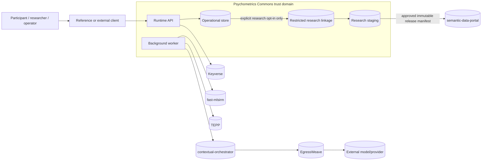

# Security, Privacy, and Data Boundary Architecture

- Status: Normative architecture view
- Date: 2026-08-09
- Scope: Psychometrics Commons-owned processing and cross-service trust boundaries
- Principle: preserve operational utility through separation, purpose limitation, authorization, encryption, and audit rather than blanket PII masking

## 1. Trust boundaries



Boundary rules:

- Clients are untrusted presentation surfaces. Server-side authorization is authoritative.
- Keyverse establishes authenticated identity/federation claims; it does not decide Psychometrics Commons resource authorization.
- The operational store and restricted research linkage have separate privileged-access paths.
- `fast-mlsirm` receives only the response/scoring evidence required by the pinned measurement contract.
- AI providers receive only purpose-approved projections under a provider/privacy policy; denial by the egress policy is not bypassed.
- Public/controlled research release registration never grants the portal direct access to operational participant tables.

## 2. Data classification

| Data class | Examples | Normal owner | Default exposure | Required control |
|---|---|---|---|---|
| Public product metadata | published instrument title, public limitations, public release metadata | Psychometrics Commons / portal as appropriate | public | integrity, versioning, provenance |
| Internal operational metadata | resource refs, state, timestamps, digests, retry class | Psychometrics Commons | internal | tenant/resource auth, audit, log minimization |
| Sensitive assessment content | item responses, reflective text, score details | Psychometrics Commons | participant + explicitly authorized roles | encryption, purpose-bound access, export/deletion policy |
| Direct identity | credentials, identity proofing, federation attributes | Keyverse | identity domain only | Keyverse/NIST-aligned identity controls; no duplicate credential store |
| Operational identity reference | `participant_ref`, optional `keyverse_subject_ref` mapping | Psychometrics Commons | restricted product paths | opaque refs, server auth, no public research release |
| Restricted research linkage | operational ↔ research pseudonym mapping | restricted linkage boundary | highly restricted | separate role/policy, audit, encryption, no analytics access |
| Research staging | pseudonymized contributed observations and derived variables | research workflow | approved research roles | purpose/scope filter, privacy review, rare-combination checks |
| Approved research release | reviewed dataset snapshot + release bundle | semantic-data-portal registration / approved artifact store | public, controlled, or private by release class | immutable digest, license/consent scope, access policy |
| Secrets and signing material | service credentials, encryption keys, provider secrets | deployment secret manager | never application payload | least privilege, rotation, no logs/client exposure |

## 3. Identity and authentication

Keyverse remains the identity/federation system of record. Psychometrics Commons is a relying product and validates assertions before using them.

At minimum, token validation must enforce:

- expected issuer;
- intended audience;
- signature and supported algorithm policy;
- expiration/not-before semantics;
- protocol-appropriate state/nonce/replay protections;
- exact subject and tenant/organization claim interpretation governed by a versioned adapter;
- no product authorization derived solely from a broad Keyverse administrative role.

NIST SP 800-63-4 and its authentication/federation companion volumes are used as current digital-identity guidance where applicable. OAuth/OIDC implementations must follow current protocol-specific requirements and the OAuth 2.0 Security Best Current Practice (RFC 9700); deprecated or insecure grant/redirect behaviors are not reintroduced for compatibility.

Anonymous participation is first-class. Anonymous session credentials are short-lived, audience-bound product credentials and do not become a backdoor persistent identity system.

## 4. Authorization model

Authorization decisions are resource- and purpose-specific.

Required decision inputs, as applicable:

```text
authenticated_subject or anonymous_session_subject
tenant_ref
resource_ref
resource_owner_ref
requested_action
product_role / research_role
consent_scope
resource_state
sharing_token_audience/expiry if used
```

Rules:

- Tenant context for state-changing requests is derived from authenticated authorization or, for an anonymous session command, from the loaded `assessment_participant` row. It is not taken from an untrusted body field, a caller-invented `ResourceScope`, or an implicit default.
- Public opaque identifiers are identifiers, not authorization capabilities.
- Research steward, instrument publisher, participant result owner, and identity administrator are distinct authorities.
- A sharing link, if introduced, must be revocable, scoped to an exact resource/audience, expire by default, and not reveal raw responses unless explicitly permitted by the participant and product policy.

## 5. Consent and purpose limitation

At minimum, separate consent/purpose records exist for:

- core service processing;
- optional persistent account/history;
- optional longitudinal processing;
- optional research contribution;
- optional communications.

Consent is immutable versioned evidence. Revocation appends later evidence rather than editing history. Research contribution is absent by default and cannot be inferred from account creation, assessment completion, or use of a reflection module.

The product stores the minimum data required for each purpose projection. This does not mean globally masking all PII. Authorized business/scientific workflows receive the fields needed for the approved purpose; unauthorized contexts receive no field or no access.

## 6. Research pseudonymization and re-identification control


Required controls:

- public release never contains Keyverse subject, operational participant reference, or linkage key;
- release variables are allowlisted by approved research scope;
- free-text/raw response content is excluded by default unless a separately approved release policy demonstrates necessity and acceptable disclosure risk;
- rare combinations, small cells, longitudinal uniqueness, and linked contextual attributes receive re-identification-risk review;
- controlled-access release uses explicit access decisions and durable access evidence;
- withdrawal affects future processing/releases according to the consent and applicable obligations; already published immutable releases are handled according to the pre-disclosed release policy rather than silently rewritten.

## 7. AI data boundary

AI tasks are optional capabilities. Each task contract declares:

```text
task_type
purpose
allowed_data_classes
provider/deployment_class
model_version or immutable routing evidence
residency_policy
retention_policy
maximum input/output size
output_schema_version
timeout/retry policy
audit/provenance requirements
```

Provider output is untrusted. Validation rejects duplicate JSON keys, unknown required semantics, invalid references, non-finite numeric values, oversized payloads, unapproved evidence, and provenance mismatch.

PII/sensitive content may be sent to a model only when the exact task purpose, authorization, provider class, residency, retention, and contractual policy permit it. Availability or lower price does not justify downgrading the approved privacy/provider class.

## 8. Threat model

| Threat | Example | Required prevention/detection |
|---|---|---|
| Cross-tenant IDOR | valid user guesses another tenant's `result_ref` | server-side tenant/resource authorization + negative tests |
| Session hijack/replay | stolen anonymous token or repeated client event | short-lived audience-bound credential; idempotency/conflict checks; rotation policy |
| Account-link takeover | attacker links another anonymous history | proof of control for both anonymous session and authenticated subject; audited mapping |
| Response/result tampering | mutable historical response or score | immutable snapshots, content digests, supersession, restricted writes |
| Stale scientific contract | scoring through mutable `latest` alias | resolve/pin exact versions/digests before scoring; fail on mismatch |
| Event replay/duplication | outbox delivery repeats side effect | consumer inbox/deduplication before side effect |
| Prompt injection / provider misuse | assessment text attempts to change evaluator behavior | data treated as inert content, closed tool/prompt contracts, bounded AI roles |
| SSRF/egress exfiltration | AI/tool tries arbitrary host | EgressWeave/equivalent exact-authority controls; no direct bypass |
| Research re-identification | release carries joinable operational identifiers | separate pseudonym namespace, field allowlist, privacy review, negative release tests |
| Over-retention | deleted participant data remains without basis | durable data-rights workflow, dependency propagation, explicit retention exceptions |
| Supply-chain compromise | unpinned action/dependency injects code | immutable pins where practical, SBOM, SAST, secret scanning, provenance/reproducible release gates |
| Log disclosure | raw responses/tokens in exception traces | safe error taxonomy, digest/ref logging, redaction of credentials and unnecessary payloads |
| Privilege confusion | Keyverse admin becomes release approver | separate domain-role checks; least privilege; authorization tests |

## 9. Security testing contract

At minimum as features appear:

- cross-tenant read/write negative tests;
- object-reference enumeration/authorization tests;
- anonymous-token audience/expiry/replay tests;
- OIDC issuer/audience/signature/nonce-state tests;
- account-linking conflict/replay tests;
- idempotency-key cross-tenant and conflicting-content tests;
- research-release identifier/field leakage tests;
- outbox/inbox replay and poison-message tests;
- AI output/prompt injection and oversized payload tests;
- secret/log disclosure regression tests;
- dependency/SBOM/provenance gates;
- backup/restore access-boundary validation after recovery.

## 10. Data retention architecture

Retention duration is a deployment/product policy, not hard-coded into the domain model. Before GA, every deployment profile must define and test retention policies for at least:

- anonymous unfinished sessions;
- completed operational responses/results;
- audit/security evidence;
- restricted linkage;
- research staging;
- approved/published research releases;
- AI traces and provider artifacts;
- backups and restored copies.

A deletion request can be marked `partially_retained_with_basis` only when the retained scopes and basis are explicit and auditable. Retention exceptions never permit the product to claim that retained data was deleted.

## 11. Compliance posture

The architecture is designed to make SOC 2 and CSAP evidence collection feasible, but repository documentation and controls do not constitute certification. Claims must distinguish architecture readiness, implemented control, tested evidence, and independently certified status.

## 12. References

Lodderstedt, T., Bradley, J., Labunets, A., & Fett, D. (2025). *Best Current Practice for OAuth 2.0 Security* (RFC 9700). Internet Engineering Task Force. https://doi.org/10.17487/RFC9700

Temoshok, D., Choong, Y.-Y., Galluzzo, R., LaSalle, M., Regenscheid, A., Proud-Madruga, D., Gupta, S., & Lefkovitz, N. (2025). *Digital Identity Guidelines* (NIST SP 800-63-4). National Institute of Standards and Technology. https://doi.org/10.6028/NIST.SP.800-63-4

Temoshok, D., Richer, J., Choong, Y.-Y., Fenton, J., Lefkovitz, N., Regenscheid, A., & Galluzzo, R. (2025). *Digital Identity Guidelines: Federation and Assertions* (NIST SP 800-63C-4). National Institute of Standards and Technology.
