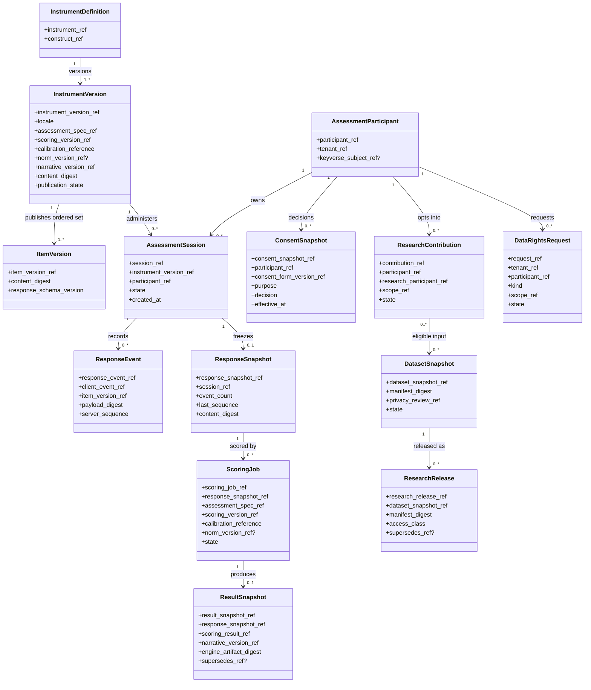
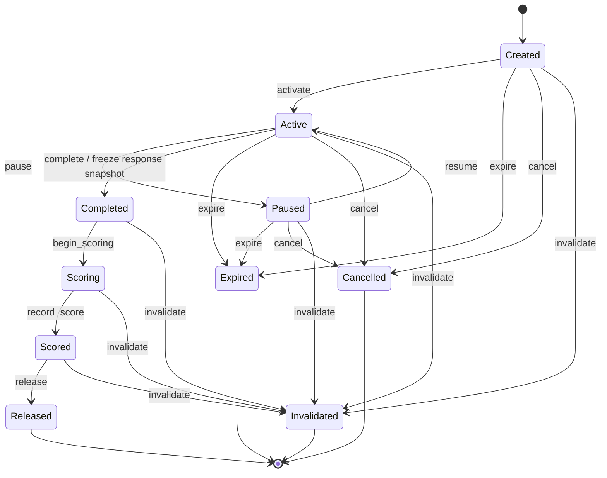
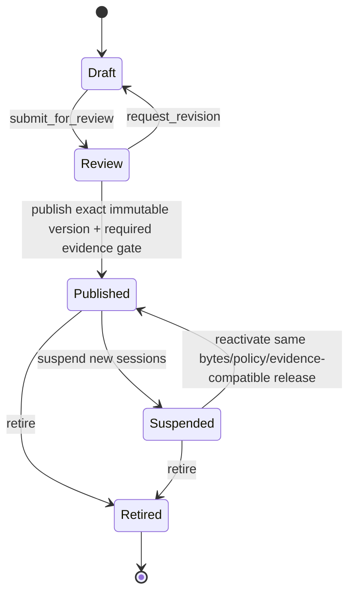
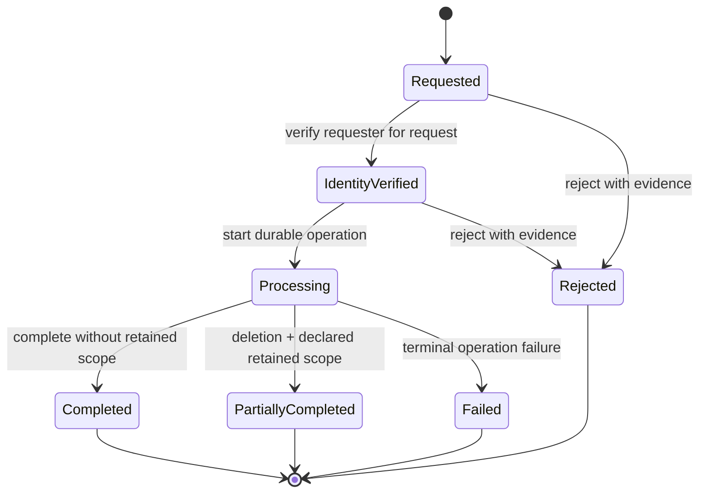
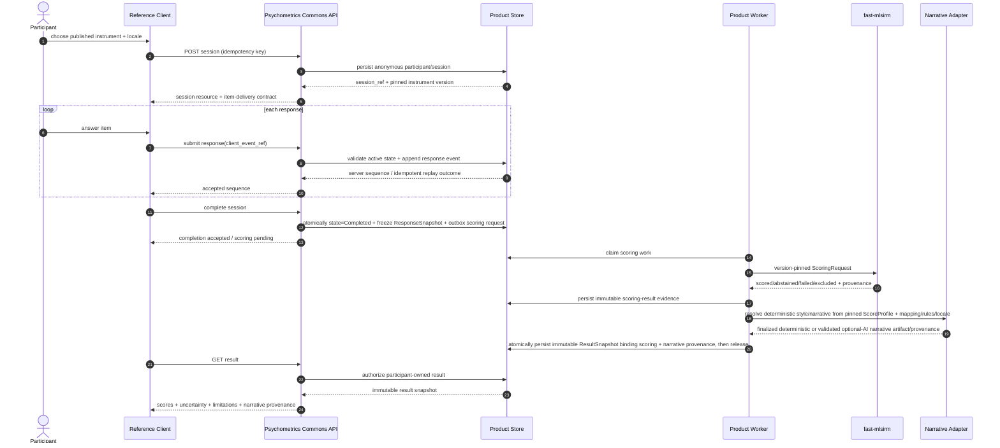
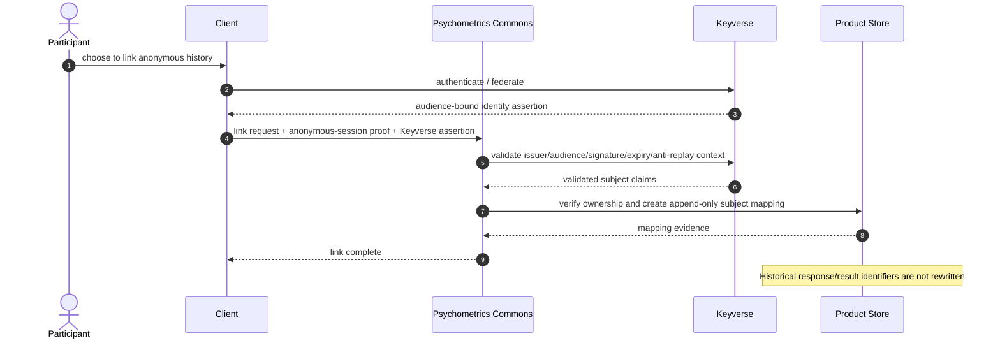
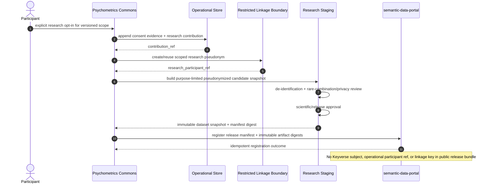

# UML-Aligned Domain and Behavior Models

- Status: Normative architecture view
- Date: 2026-08-09
- Notation: Mermaid diagrams using OMG UML 2.5.1 structural/behavioral semantics where the notation permits
- Authority: accepted ADRs and PRD/TRD override a diagram if a contradiction is discovered

These diagrams describe the intended product semantics. They do **not** claim that every class or transport adapter shown is already implemented on protected main. Current implementation evidence is tracked separately in `docs/TRACEABILITY.md`.

## 1. Domain class model



### Domain-model rules

- `InstrumentVersion`, `ResponseSnapshot`, `ResultSnapshot`, and published `ResearchRelease` are immutable semantic artifacts.
- `ScoringJob` is operational state; `ResultSnapshot` is scientific/product evidence. They are not the same aggregate.
- `ConsentSnapshot` records a purpose-specific decision and exact form/version evidence. Research consent is not inferred from service consent.
- `ResearchContribution` is a product-domain participation record; public research data uses a separate research participant namespace behind the restricted linkage boundary.
- Associations involving external scientific artifacts are references, not cross-service foreign keys into another service database.
- A narrative/presentation artifact is finalized before a `ResultSnapshot` that references it is created; an immutable result is never modified later to attach narrative content. If narrative persistence becomes a separate aggregate, its relationship and supersession semantics require a corresponding ERD/ADR update.

## 2. Assessment-session state machine



Idempotent command replays may confirm an already-applied transition when the underlying evidence is identical. They must never rewind a later state or change frozen evidence.

## 3. Instrument-publication state machine



A semantic content change after publication creates a new instrument version; it does not transition a published version back to Draft. ADR-0019 requires exact-version scientific/content/rights evidence before `Review -> Published` succeeds.

## 4. Data-rights state machine



Export cannot complete with a deletion-retention exception. Exact terminal replays are idempotent; conflicting evidence for the same lifecycle reference fails closed.

## 5. Anonymous assessment happy-path sequence



The result snapshot is created exactly once with the narrative-version/provenance it references. A later narrative rerender or correction creates a separately versioned presentation artifact and/or a superseding result according to ADR-0010/ADR-0018; it never mutates the prior immutable result in place.

## 6. Scoring dependency outage sequence

```mermaid
sequenceDiagram
    autonumber
    actor P as Participant
    participant A as Psychometrics Commons API
    participant DB as Product Store
    participant W as Product Worker
    participant F as fast-mlsirm scoring path

    P->>A: complete assessment
    A->>DB: commit Completed + immutable response snapshot + outbox
    A-->>P: completion durable; scoring pending

    W->>F: submit pinned scoring request
    F--xW: unavailable / retryable transport failure
    W->>DB: record typed retryable job failure + bounded retry schedule
    Note over DB: Response snapshot remains immutable and durable

    W->>F: retry same version-pinned request
    F-->>W: valid scoring result
    W->>DB: persist scoring evidence; result finalization proceeds only after required presentation provenance is resolved
```

No fallback score may be fabricated merely because the scoring dependency is unavailable.

## 7. Optional account-linking sequence



## 8. Research-contribution and release sequence



## 9. Durable event consumption sequence

```mermaid
sequenceDiagram
    autonumber
    participant B as Broker / Transport
    participant C as Product Consumer
    participant DB as Product Store
    participant X as External Dependency

    B->>C: deliver event(source, tenant, event_ref, schema, payload_digest, payload)
    C->>C: validate schema + canonical payload digest + tenant/resource binding
    C->>DB: create/find dedup record as pending
    C->>DB: atomically mark processing + persist local durable work/outbox
    DB-->>C: processing evidence + stable external idempotency key
    C->>X: perform/retry external effect with stable idempotency key
    X-->>C: durable idempotent completion evidence
    C->>DB: record completion evidence + mark inbox completed

    Note over C,DB: A crash before completion leaves recoverable pending/processing state; receipt alone never suppresses an unperformed effect
```

For effects fully owned by the same PostgreSQL transaction, the domain side effect and inbox completion may instead commit atomically without the external-work step. ADR-0014 and ADR-0015 govern canonical payload integrity, deduplication, tenant binding, crash recovery, and quarantine.

## 10. Modeling conventions

- Classes shown here are domain concepts, not a mandate that each concept map one-to-one to a Rust struct or database table.
- A sequence message is a contract responsibility, not evidence that the HTTP/event transport already exists.
- External systems are accessed through versioned adapters; direct database joins across bounded contexts are forbidden.
- Failure paths shown in the TRD remain normative even if omitted from a simplified happy-path diagram.
- Target-only sequence actors/containers remain target architecture until `docs/TRACEABILITY.md` links protected-main implementation evidence.

## 11. Reference

Object Management Group. (2017). *OMG Unified Modeling Language (OMG UML), Version 2.5.1*.
